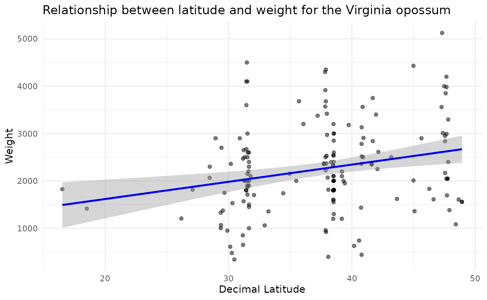

# Exploring patterns of Bergmann’s rule

In this example we query Arctos for morphological data for *Didelphis
virginiana* (the Virginia opossum) and use geographical coordinate data
and weights to explore patterns of Bergmann’s rule.

``` r
# Install packages if needed
# install.packages("ArctosR")
# install.packages("ggplot2")

# Load packages
library(ArctosR)
library(ggplot2)
```

## Querying Arctos for relevant data

First, we query Arctos for *Didelphis virginiana* records using
[`get_records()`](https://hrhwilliams.github.io/ArctosR/reference/get_records.md),
requesting only the GUID identifier, decimal latitude, longitude,
weight, and age columns for each specimen.

``` r
# Download all available records of Didelphis virginiana, and include latitude
# and longitude data
brule_query <- get_records(
  scientific_name = "Didelphis virginiana",
  columns = list("guid", "dec_lat", "dec_long", "weight", "age"),
  api_key = YOUR_API_KEY,
  all_records = TRUE
)
```

## Processing query to obtain size

Because of the multiple formats and options in which data can be
uploaded to Arctos, data cleaning steps are needed before we can analyze
it. The code below helps to filter data to keep only what is relevant
for analysis and format it as numeric values

``` r
# Obtain data frame from response 
brule_query_df <- response_data(brule_query)
colnames(brule_query_df)
#> [1] "rights"   "dec_lat"  "guid"     "dec_long" "weight"   "age"

# Filter by age and keep a subset of columns
adults <- brule_query_df$age %in% c("adult", "")

brule_data <- brule_query_df[adults, c("dec_lat", "dec_long", "weight", "age")]

# Filter to keep records with latitude information
brule_data <- brule_data[brule_data$dec_lat != "", ]

# Format latitude as numeric
brule_data$dec_lat <- as.numeric(brule_data$dec_lat)

# Filter by weight
## Remove no data
unique(brule_data$weight)
#>   [1] ""                      "1710 g"                "2 kg"                 
#>   [4] "4.1 kg"                "1905 g"                "2.5 kg"               
#>   [7] "1868 g"                "3 kg"                  "2150 g"               
#>  [10] "1.8 kg"                "1.5 kg"                "1.45 kg"              
#>  [13] "2200 g"                "2100 g"                "1900 g"               
#>  [16] "2400 g"                "2000 g"                "2600 g"               
#>  [19] "2300 g"                "1000 g"                "1206 g"               
#>  [22] "1374 g"                "1067 g"                "1329 g"               
#>  [25] "1003 g"                "1415 g"                "3.4 g"                
#>  [28] "610 g"                 "340 g"                 "2.67 kg"              
#>  [31] "2360 g"                "850 g"                 "2.9 kg"               
#>  [34] "1.57 kg"               "180 g"                 "1.75 kg"              
#>  [37] "950 g"                 "1.53 kg"               "2.2999999999999998 kg"
#>  [40] "2.0649999999999999 kg" "81.2 g"                "650 g"                
#>  [43] "2.0099999999999998 kg" "1.95 kg"               "1.7 kg"               
#>  [46] "2.65 kg"               "220 g"                 "2.4700000000000002 kg"
#>  [49] "1355 g"                "255 g"                 "93.7 g"               
#>  [52] "1060 g"                "4500 g"                "3.6 kg"               
#>  [55] "2.6 kg"                "1814 g"                "1606 g"               
#>  [58] "3010 g"                "2010 g"                "1557 g"               
#>  [61] "4430 g"                "1825 g"                "2900 g"               
#>  [64] "4000 g"                "2993 g"                "3.18 kg"              
#>  [67] ".74 kg"                "3683.2 g"              "14 oz"                
#>  [70] "2500 g"                "110 g"                 "2516 g"               
#>  [73] "3562 g"                "2908 g"                "440 g"                
#>  [76] "1435 g"                "2781 g"                "2359 g"               
#>  [79] "3131 g"                "1800 g"                "1600 g"               
#>  [82] "1550 g"                "177 g"                 "2850 g"               
#>  [85] "8 g"                   "11 g"                  "17 g"                 
#>  [88] "13 g"                  "22 g"                  "20 g"                 
#>  [91] "23 g"                  "21 g"                  "24 g"                 
#>  [94] "16 g"                  "12 g"                  "14 g"                 
#>  [97] "15 g"                  "19 g"                  "18 g"                 
#> [100] "10 g"                  "9 g"                   "33 g"                 
#> [103] "34 g"                  "32 g"                  "30 g"                 
#> [106] "31 g"                  "6 g"                   "7 g"                  
#> [109] "4 g"                   "5 g"                   "40 g"                 
#> [112] "39 g"                  "41 g"                  "36 g"                 
#> [115] "43 g"                  "42 g"                  "1300 g"               
#> [118] "2.2 kg"                "2.1 kg"                "1200 g"               
#> [121] "3200 g"                "120 g"                 "2325 g"               
#> [124] "1812 g"                "233 g"                 "2002 g"               
#> [127] "2537.2 g"              "3000 g"                "64 oz"                
#> [130] "2352 g"                "2370 g"                "1360 g"               
#> [133] "1620.1 g"              "0 g"                   "2.35 kg"              
#> [136] "66 g"                  "131 g"                 "135 g"                
#> [139] "136.1 g"               "87 g"                  "2700.0 g"             
#> [142] "157 g"                 "4300 g"                "3680 g"               
#> [145] "2530 g"                "3571 g"                "2972 g"               
#> [148] "4350 g"                "6.76 g"                "3916 g"               
#> [151] "92 g"                  "2.37 kg"               "627 g"                
#> [154] "2397 g"                "66.1 g"                "58.9 g"               
#> [157] "104.4 g"               "116.6 g"               "3377 g"               
#> [160] "921 g"                 "64.8 g"                "3419 g"               
#> [163] "2070 g"                "957.5 g"               "2223 g"               
#> [166] "178.9 g"               "1.61 kg"               "169 g"                
#> [169] "3.2 kg"                "1740 g"                "478.0 g"              
#> [172] "1383 g"                "1832 g"                "3.295 kg"             
#> [175] "1694.2 g"              "2.84 kg"               "2168 g"               
#> [178] "2.95 kg"               "26.0 g"                "2.05 kg"              
#> [181] "2.045 kg"              "3.98 kg"               "4.2 kg"               
#> [184] "3.75 kg"               "3.4 kg"                "1083 g"               
#> [187] "3850 g"                "3560 g"                "5125 g"               
#> [190] "26.5 kg"               "33 kg"                 "2610.5 g"             
#> [193] "2250 g"

brule_data <- brule_data[brule_data$weight != "", ]

## Process data to keep it in the same units
oweghts <- brule_data$weight

### Erase units from values
brule_data$weight <- gsub(" g$", "", brule_data$weight)
brule_data$weight <- gsub(" kg$", "", brule_data$weight)
brule_data$weight <- gsub(" oz$", "", brule_data$weight)

### Make it numeric
brule_data$weight <- as.numeric(brule_data$weight)

### Transform units
woz <- grep(" oz$", oweghts)
wkg <- grep(" kg$", oweghts)

brule_data$weight[woz] <- brule_data$weight[woz] * 28.35
brule_data$weight[wkg] <- brule_data$weight[wkg] * 1000

### Filter by weights considered to represent adult sizes
brule_data <- brule_data[brule_data$weight > 300 &
                          brule_data$weight < 6500, ]
```

## Exploring if Bergmann’s rule applies to this example

The following lines of code help to produce a plot to explore the
relationship between latitude and weight. Under the Bergmann’s rule, we
expect to see a positive relationship (i.e., weight increases with
latitude).

``` r
# Create the plot with a linear regression line
ggplot(brule_data, aes(x = dec_lat, y = weight)) +
  geom_point(alpha = 0.5) + 
  geom_smooth(formula = "y ~ x", method = "lm", col = "blue") + 
  labs(title = "Relationship between latitude and weight for the Virginia opossum",
       x = "Decimal Latitude",
       y = "Weight") +
  theme_minimal() 
```


