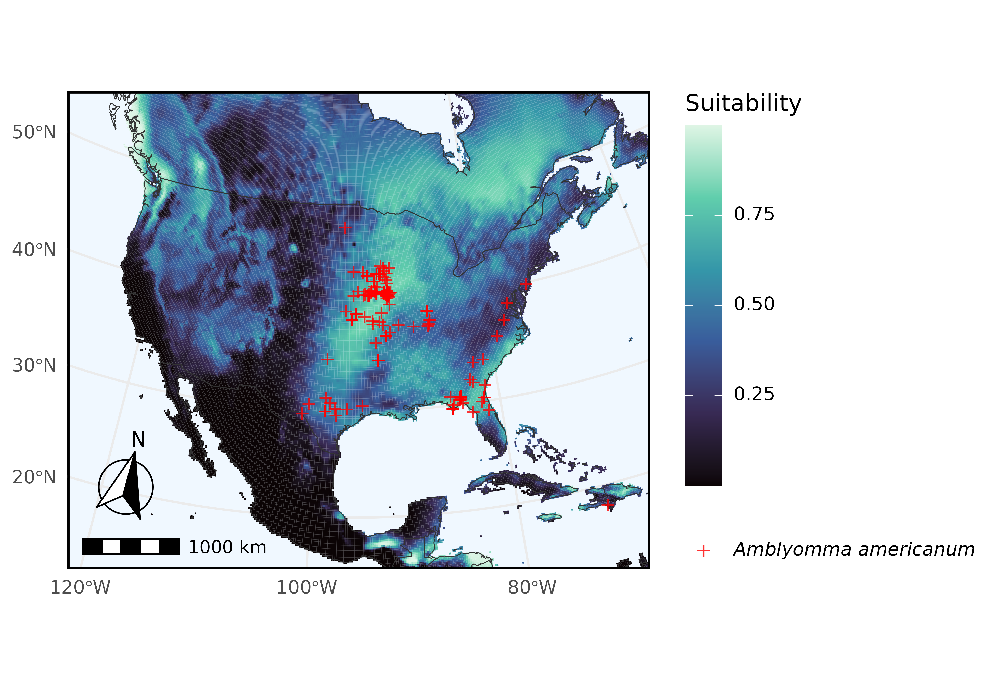

# Performing ecological niche modeling with ArctosR data

In this example we query Arctos for records of *Amblyomma americanum*
(the turkey tick) and use their geographical coordinate data as input
for ecological niche modeling (ENM) via
[kuenm2](https://marlonecobos.github.io/kuenm2/). This vignette guides
on downloading data directly from Arctos via ArctosR to use it in a
simple ENM exercise.

``` r
# Install packages if needed
# install.packages("ArctosR")
# install.packages("geodata")
# install.packages("ggplot2")
# install.packages("ggspatial")
# install.packages("ggtext")
# install.packages("kuenm2")
# install.packages("maps")
# install.packages("terra")

# Load packages
library(ArctosR)
library(geodata)
#> Loading required package: terra
#> terra 1.9.11
library(ggplot2)
library(ggspatial)
library(ggtext)
library(kuenm2)
#> 
#> Attaching package: 'kuenm2'
#> The following object is masked from 'package:ggplot2':
#> 
#>     remove_missing
library(maps)
```

## Querying Arctos for occurrence records

First, we query Arctos for turkey tick records using
[`get_records()`](https://hrhwilliams.github.io/ArctosR/reference/get_records.md),
requesting only the GUID identifier, decimal latitude, and longitude
columns for each specimen.

``` r
# Download all available records of Amblyomma americanum, and include latitude
# and longitude data
turkey_tick_query <- get_records(
  scientific_name = "Amblyomma americanum",
  columns = list("guid", "dec_lat", "dec_long"),
  api_key = YOUR_API_KEY,
  all_records = TRUE
)
```

## Filtering and cleaning data for kuenm2

Next, we filter the Arctos data to specimens collected just in North
America, and relabel the columns `dec_lat` and `dec_long` to `latitude`
and `longitude`.

``` r
# Limits on latitude and longitude for the Arctos data and for climate data
latitude_north_lim <- 60
latitude_south_lim <- 10
longitude_east_lim <- -50
longitude_west_lim <- -130

# Get response data.frame from ArctosR
occurrences_raw <- response_data(turkey_tick_query)

# Relabel columns
occurrences <- data.frame(
  species = "Amblyomma americanum", 
  longitude = as.numeric(occurrences_raw$dec_long),
  latitude = as.numeric(occurrences_raw$dec_lat)
)

# Filter to known geographic range of the species
filter <- occurrences$longitude > longitude_west_lim &
  occurrences$latitude < latitude_north_lim | 
  is.na(occurrences$longitude) |
  is.na(occurrences$latitude)

occurrences_filter <- occurrences[filter, ]
```

## Downloading environmental data

Next, we use the [geodata](https://github.com/rspatial/geodata) package
to download climate data from [WorldClim](https://www.worldclim.org/),
which will form part of the input into the models we are going to train.
These data will be saved in a directory.

``` r
# Get current working directory
project_root <- getwd()

# Get environmental data
biovars <- worldclim_global(var = "bio", res = 10, path = project_root)
```

Then, we filter the [WorldClim](https://www.worldclim.org/) data to an
area in North America that is relevant to the distribution of the
species.

``` r
# Mask environmental layers to an area relevant for records and predictions
# Transform occurrences into spatial points 
occ_geo_points <- vect(occurrences_filter, geom = c("longitude", "latitude"), 
                       crs = crs(biovars))

# Buffer records
occ_buffer <- buffer(occ_geo_points, width = 100000)

# Mask layers with buffer
biovar_mask <- crop(biovars[[c(1, 7, 12, 15)]], occ_buffer, mask = TRUE)

# Mask layers to an extent within North America
biovar_na <- crop(biovars[[c(1, 7, 12, 15)]], ext(longitude_west_lim, longitude_east_lim, latitude_south_lim, latitude_north_lim))
```

## Cleaning and preparing data for ENM

Now, we use [kuenm2](https://marlonecobos.github.io/kuenm2/)’s built-in
data cleaning functions to prepare the data for ecological niche
modeling.

``` r
# Basic data cleaning (remove duplicates, no data, (0,0) coordinates)
occ_clean1 <- initial_cleaning(
  data = occurrences_filter, 
  species = "species", 
  x = "longitude", 
  y = "latitude", 
  remove_na = TRUE, 
  remove_empty = TRUE, 
  remove_duplicates = TRUE
) 

# Remove duplicates based on layer pixel
occ_clean2 <- remove_cell_duplicates(
  data = occ_clean1,
  x = "longitude", 
  y = "latitude",
  raster_layer = biovar_mask[[1]]
)

nrow(occ_clean2)
#> [1] 96
```

## ENM process using kuenm2

We start by preparing the data the way it is needed for the next step,
model selection.

``` r
# Prepare data for models
d <- prepare_data(
  algorithm = "maxnet",
  occ = occ_clean2,
  x = "longitude",
  y = "latitude",
  raster_variables = biovar_mask,
  species = "Amblyomma americanum",
  partition_method = "kfolds", 
  n_partitions = 4,
  n_background = 1000,
  features = c("lq", "lqp"),
  r_multiplier = c(0.1, 1, 2)
)
```

Now we use the prepared data to perform model selection.

``` r
# Run model selection
cal <- calibration(
  data = d, 
  error_considered = 5,
  omission_rate = 5
)
#> Task 1/1: fitting and evaluating models:
#>   |                                                                              |                                                                      |   0%  |                                                                              |=                                                                     |   2%  |                                                                              |==                                                                    |   3%  |                                                                              |===                                                                   |   5%  |                                                                              |====                                                                  |   6%  |                                                                              |=====                                                                 |   8%  |                                                                              |======                                                                |   9%  |                                                                              |=======                                                               |  11%  |                                                                              |========                                                              |  12%  |                                                                              |==========                                                            |  14%  |                                                                              |===========                                                           |  15%  |                                                                              |============                                                          |  17%  |                                                                              |=============                                                         |  18%  |                                                                              |==============                                                        |  20%  |                                                                              |===============                                                       |  21%  |                                                                              |================                                                      |  23%  |                                                                              |=================                                                     |  24%  |                                                                              |==================                                                    |  26%  |                                                                              |===================                                                   |  27%  |                                                                              |====================                                                  |  29%  |                                                                              |=====================                                                 |  30%  |                                                                              |======================                                                |  32%  |                                                                              |=======================                                               |  33%  |                                                                              |========================                                              |  35%  |                                                                              |=========================                                             |  36%  |                                                                              |===========================                                           |  38%  |                                                                              |============================                                          |  39%  |                                                                              |=============================                                         |  41%  |                                                                              |==============================                                        |  42%  |                                                                              |===============================                                       |  44%  |                                                                              |================================                                      |  45%  |                                                                              |=================================                                     |  47%  |                                                                              |==================================                                    |  48%  |                                                                              |===================================                                   |  50%  |                                                                              |====================================                                  |  52%  |                                                                              |=====================================                                 |  53%  |                                                                              |======================================                                |  55%  |                                                                              |=======================================                               |  56%  |                                                                              |========================================                              |  58%  |                                                                              |=========================================                             |  59%  |                                                                              |==========================================                            |  61%  |                                                                              |===========================================                           |  62%  |                                                                              |=============================================                         |  64%  |                                                                              |==============================================                        |  65%  |                                                                              |===============================================                       |  67%  |                                                                              |================================================                      |  68%  |                                                                              |=================================================                     |  70%  |                                                                              |==================================================                    |  71%  |                                                                              |===================================================                   |  73%  |                                                                              |====================================================                  |  74%  |                                                                              |=====================================================                 |  76%  |                                                                              |======================================================                |  77%  |                                                                              |=======================================================               |  79%  |                                                                              |========================================================              |  80%  |                                                                              |=========================================================             |  82%  |                                                                              |==========================================================            |  83%  |                                                                              |===========================================================           |  85%  |                                                                              |============================================================          |  86%  |                                                                              |==============================================================        |  88%  |                                                                              |===============================================================       |  89%  |                                                                              |================================================================      |  91%  |                                                                              |=================================================================     |  92%  |                                                                              |==================================================================    |  94%  |                                                                              |===================================================================   |  95%  |                                                                              |====================================================================  |  97%  |                                                                              |===================================================================== |  98%  |                                                                              |======================================================================| 100%
#> 
#> 
#> Model selection step:
#> Selecting best among 66 models.
#> Calculating pROC...
#> 
#> Filtering 66 models.
#> Removing 0 model(s) because they failed to fit.
#> 21 model(s) were selected with omission rate below 5%.
#> Selecting 4 final model(s) with delta AIC <2.
#> Validating pROC of selected models...
#>   |                                                                              |                                                                      |   0%  |                                                                              |==================                                                    |  25%  |                                                                              |===================================                                   |  50%  |                                                                              |====================================================                  |  75%  |                                                                              |======================================================================| 100%
#> 
#> All selected models have significant pROC values.
```

We fit selected models and predict over a relevant are to explore
suitable conditions for this tick.

``` r
# Fit selected models
mfit <- fit_selected(calibration_results = cal)
#> 
#> Fitting full models...
#>   |                                                                              |                                                                      |   0%  |                                                                              |==================                                                    |  25%  |                                                                              |===================================                                   |  50%  |                                                                              |====================================================                  |  75%  |                                                                              |======================================================================| 100%

# Predict to part of North America
pred <- predict_selected(mfit, new_variables = biovar_na)
#>   |                                                                              |                                                                      |   0%  |                                                                              |==================                                                    |  25%  |                                                                              |===================================                                   |  50%  |                                                                              |====================================================                  |  75%  |                                                                              |======================================================================| 100%
```

## Visualizing model prediction

Here we use [ggplot2](https://ggplot2.tidyverse.org/) to plot predicted
suitability for *Amblyomma americanum*, with occurrences overlaid.

``` r
pred_df <- as.data.frame(pred$General_consensus[["median"]], xy = TRUE)
occ_points_df <- as.data.frame(occ_geo_points, geom = "XY")
colnames(pred_df) <- c("long", "lat", "suitability")

plot_map <- map_data("world")

tick <- ggplot() +
  geom_tile(
    data = pred_df,
    aes(x = long, y = lat, fill = suitability)
  ) +
  geom_polygon(
    data = plot_map,
    aes(x = long, y = lat, group = group),
    fill = NA, color = "gray20", linewidth = 0.2
  ) +
  geom_point(
    data = occ_points_df,
    aes(x = x, y = y, color = "Amblyomma americanum"),
    shape = "+", size = 3, alpha = 0.8
  ) +
  scale_color_manual(
    name = NULL,
    values = c("Amblyomma americanum" = "red"),
    labels = c("*Amblyomma americanum*")
  ) +
  scale_fill_viridis_c(
    name = "Suitability",
    option = "mako",
    na.value = "aliceblue"
  ) +
  coord_sf(
    crs = "EPSG:5070",
    xlim = c(-130, -60),
    ylim = c(15, 60),
    default_crs = sf::st_crs(4326),
    expand = FALSE
  ) +
  labs(
    x = NULL, y = NULL
  ) +
  annotation_scale(
    location = "bl",
    width_hint = 0.3
  ) +
  annotation_north_arrow(
    location = "bl",
    which_north = "true", 
    pad_x = unit(0.1, "in"),
    pad_y = unit(0.3, "in"),
    style = north_arrow_fancy_orienteering
  ) +
  theme_minimal() +
  theme(
    panel.background = element_rect(fill = "aliceblue"),
    panel.border = element_rect(color = "black", fill = NA, linewidth = 1),
    legend.text = element_markdown()
  )
  
ggsave(
  filename = "figures/tick.png",
  plot = tick,
  width = 6.53,
  height = 4.5,
  dpi = 600,
  create.dir = TRUE
)
#> Warning: Removed 7 rows containing missing values or values outside the scale range
#> (`geom_point()`).
```


