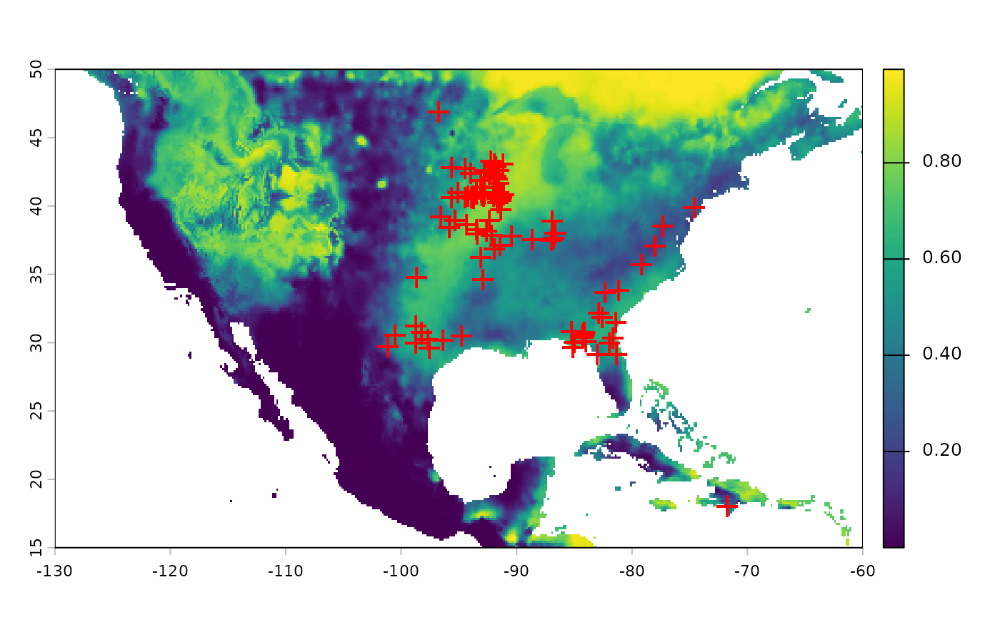

# Performing ecological niche modeling with ArctosR data

``` r
# Install packages if needed
# install.packages("ArctosR")
# install.packages("geodata")
# install.packages("kuenm2")

# Load packages
library(ArctosR)
library(geodata)
#> Loading required package: terra
#> terra 1.9.11
library(kuenm2)
```

``` r
## Count records in Arctos 
turkey_tick_records <- get_record_count(
  scientific_name = "Amblyomma americanum",
  api_key = YOUR_API_KEY
)

## Get all available records
turkey_tick_query <- get_records(
  scientific_name = "Amblyomma americanum",
  columns = list("guid", "dec_lat", "dec_long"),
  api_key = YOUR_API_KEY,
  all_records = TRUE
)
```

``` r
project_root <- getwd()


occurrences_raw <- response_data(turkey_tick_query)

## Get environmental data
biovars <- worldclim_global(var = "bio", res = 10, path = project_root)


# Data processing 
## formatting as data frame
occurrences <- data.frame(species = "Amblyomma americanum", 
                          longitude = as.numeric(occurrences_raw$dec_long),
                          latitude = as.numeric(occurrences_raw$dec_lat))

## filtering geographically to known range of species
filter <- occurrences$longitude > -120 & occurrences$latitude < 50 | 
  is.na(occurrences$longitude) | is.na(occurrences$latitude)

occurrences_filter <- occurrences[filter, ]

## Mask environmental layers to an area relevant for records and predictions
### Transform occurrences into spatial points 
occ_geo_points <- vect(occurrences_filter, geom = c("longitude", "latitude"), 
                       crs = crs(biovars))

### Buffer records
occ_buffer <- buffer(occ_geo_points, width = 100000)

### Mask layers with buffer
biovar_mask <- crop(biovars[[c(1, 7, 12, 15)]], occ_buffer, mask = TRUE)

### Mask layers to an extent within North America
biovar_na <- crop(biovars[[c(1, 7, 12, 15)]], ext(-130, -60, 15, 50))


# Data cleaning
## Basic data cleaning (remove duplicates, no data, (0,0) coordinates)
occ_clean1 <- initial_cleaning(data = occurrences_filter, 
                               species = "species", 
                               x = "longitude", 
                               y = "latitude", 
                               remove_na = TRUE, 
                               remove_empty = TRUE, 
                               remove_duplicates = TRUE) 

## Remove duplicates based on layer pixel
occ_clean2 <- remove_cell_duplicates(data = occ_clean1,
                                     x = "longitude", 
                                     y = "latitude",
                                     raster_layer = biovar_mask[[1]])

nrow(occ_clean2)
#> [1] 95


# ENM
## Prepare data for models
d <- prepare_data(algorithm = "maxnet",
                  occ = occ_clean2,
                  x = "longitude", y = "latitude",
                  raster_variables = biovar_mask,
                  species = "Amblyomma americanum",
                  partition_method = "kfolds", 
                  n_partitions = 4,
                  n_background = 1000,
                  features = c("lq", "lqp"),
                  r_multiplier = c(0.1, 1, 2))

# Run model selection
cal <- calibration(data = d, 
                   error_considered = 5,
                   omission_rate = 5)
#> Task 1/1: fitting and evaluating models:
#>   |                                                                              |                                                                      |   0%  |                                                                              |=                                                                     |   2%  |                                                                              |==                                                                    |   3%  |                                                                              |===                                                                   |   5%  |                                                                              |====                                                                  |   6%  |                                                                              |=====                                                                 |   8%  |                                                                              |======                                                                |   9%  |                                                                              |=======                                                               |  11%  |                                                                              |========                                                              |  12%  |                                                                              |==========                                                            |  14%  |                                                                              |===========                                                           |  15%  |                                                                              |============                                                          |  17%  |                                                                              |=============                                                         |  18%  |                                                                              |==============                                                        |  20%  |                                                                              |===============                                                       |  21%  |                                                                              |================                                                      |  23%  |                                                                              |=================                                                     |  24%  |                                                                              |==================                                                    |  26%  |                                                                              |===================                                                   |  27%  |                                                                              |====================                                                  |  29%  |                                                                              |=====================                                                 |  30%  |                                                                              |======================                                                |  32%  |                                                                              |=======================                                               |  33%  |                                                                              |========================                                              |  35%  |                                                                              |=========================                                             |  36%  |                                                                              |===========================                                           |  38%  |                                                                              |============================                                          |  39%  |                                                                              |=============================                                         |  41%  |                                                                              |==============================                                        |  42%  |                                                                              |===============================                                       |  44%  |                                                                              |================================                                      |  45%  |                                                                              |=================================                                     |  47%  |                                                                              |==================================                                    |  48%  |                                                                              |===================================                                   |  50%  |                                                                              |====================================                                  |  52%  |                                                                              |=====================================                                 |  53%  |                                                                              |======================================                                |  55%  |                                                                              |=======================================                               |  56%  |                                                                              |========================================                              |  58%  |                                                                              |=========================================                             |  59%  |                                                                              |==========================================                            |  61%  |                                                                              |===========================================                           |  62%  |                                                                              |=============================================                         |  64%  |                                                                              |==============================================                        |  65%  |                                                                              |===============================================                       |  67%  |                                                                              |================================================                      |  68%  |                                                                              |=================================================                     |  70%  |                                                                              |==================================================                    |  71%  |                                                                              |===================================================                   |  73%  |                                                                              |====================================================                  |  74%  |                                                                              |=====================================================                 |  76%  |                                                                              |======================================================                |  77%  |                                                                              |=======================================================               |  79%  |                                                                              |========================================================              |  80%  |                                                                              |=========================================================             |  82%  |                                                                              |==========================================================            |  83%  |                                                                              |===========================================================           |  85%  |                                                                              |============================================================          |  86%  |                                                                              |==============================================================        |  88%  |                                                                              |===============================================================       |  89%  |                                                                              |================================================================      |  91%  |                                                                              |=================================================================     |  92%  |                                                                              |==================================================================    |  94%  |                                                                              |===================================================================   |  95%  |                                                                              |====================================================================  |  97%  |                                                                              |===================================================================== |  98%  |                                                                              |======================================================================| 100%
#> 
#> 
#> Model selection step:
#> Selecting best among 66 models.
#> Calculating pROC...
#> 
#> Filtering 66 models.
#> Removing 0 model(s) because they failed to fit.
#> 18 model(s) were selected with omission rate below 5%.
#> Selecting 4 final model(s) with delta AIC <2.
#> Validating pROC of selected models...
#>   |                                                                              |                                                                      |   0%  |                                                                              |==================                                                    |  25%  |                                                                              |===================================                                   |  50%  |                                                                              |====================================================                  |  75%  |                                                                              |======================================================================| 100%
#> 
#> All selected models have significant pROC values.

## Fit selected models
mfit <- fit_selected(calibration_results = cal)
#> 
#> Fitting full models...
#>   |                                                                              |                                                                      |   0%  |                                                                              |==================                                                    |  25%  |                                                                              |===================================                                   |  50%  |                                                                              |====================================================                  |  75%  |                                                                              |======================================================================| 100%

## Predict to part of North America
pred <- predict_selected(mfit, new_variables = biovar_na)
#>   |                                                                              |                                                                      |   0%  |                                                                              |==================                                                    |  25%  |                                                                              |===================================                                   |  50%  |                                                                              |====================================================                  |  75%  |                                                                              |======================================================================| 100%


# Plot predictions and points
plot(pred$General_consensus$median)
points(occ_geo_points, col = "red", pch = "+", cex = 1.5)
```


