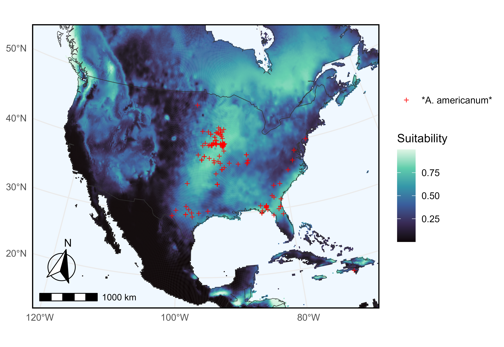

```{r, include = FALSE}
knitr::opts_chunk$set(
  collapse = TRUE,
  comment = "#>"
)
```

In this example we query Arctos for records of *Amblyomma americanum* (the
turkey tick) and use their geographical coordinate data as input for ecological
niche modeling via [kuenm2](https://marlonecobos.github.io/kuenm2/). This
vignette closely follows the usage example from
<https://github.com/marlonecobos/kuenm> but uses data downloaded directly from
Arctos via ArctosR.

```{r setup}
# Install packages if needed
# install.packages("ArctosR")
# install.packages("geodata")
# install.packages("ggplot2")
# install.packages("ggspatial")
# install.packages("ggtext")
# install.packages("kuenm2")
# install.packages("terra")

# Load packagess
library(ArctosR)
library(geodata)
library(ggplot2)
library(ggspatial)
library(ggtext)
library(kuenm2)
library(terra)
```

## Querying Arctos for occurrence records

First, we query Arctos for turkey tick records using `get_records()`, 
requesting only the GUID identifier, decimal latitude, and longitude 
columns for each specimen.

```{r eval=FALSE}
# Download all available records of Amblyomma americanum, and include latitude
# and longitude data
turkey_tick_query <- get_records(
  scientific_name = "Amblyomma americanum",
  columns = list("guid", "dec_lat", "dec_long"),
  api_key = YOUR_API_KEY,
  all_records = TRUE
)
```


```{r include=FALSE}
turkey_tick_query <- read_response_rds(
  system.file("extdata", "tick_query.RDS", package = "ArctosR"))
```

## Filtering and cleaning data for kuenm2

Next, we filter the Arctos data to specimens collected just in North America, and
relabel the columns `dec_lat` and `dec_long` to `latitude` and `longitude` as
those names are what the [kuenm2](https://marlonecobos.github.io/kuenm2/)
package expects.

```{r eval=TRUE}
# Limits on latitude and longitude for the Arctos data and for climate data
latitude_north_lim <- 60
latitude_south_lim <- 10
longitude_east_lim <- -50
longitude_west_lim <- -130


# Get response data.frame from ArctosR
occurrences_raw <- response_data(turkey_tick_query)

# Relabel columns
occurrences <- data.frame(
  species = "Amblyomma americanum", 
  longitude = as.numeric(occurrences_raw$dec_long),
  latitude = as.numeric(occurrences_raw$dec_lat)
)

# Filter to known geographic range of the species
filter <- occurrences$longitude > longitude_west_lim &
  occurrences$latitude < latitude_north_lim | 
  is.na(occurrences$longitude) |
  is.na(occurrences$latitude)

occurrences_filter <- occurrences[filter, ]
```

## Downloading environmental data

Next, we use the [geodata](https://github.com/rspatial/geodata) package to
download climate data from [WorldClim](https://www.worldclim.org/), which will
form part of the input into the models we are going to train. It will save these
data as files, so we pass it our current working directory as the path to save
those files to.

```{r eval=TRUE}
# Get working directory
project_root <- getwd()

# Get environmental data
biovars <- worldclim_global(var = "bio", res = 10, path = project_root)
```

Similarly we filter the [WorldClim](https://www.worldclim.org/) data to only
coordinates in North America.

```{r eval=TRUE}
# Mask environmental layers to an area relevant for records and predictions
# Transform occurrences into spatial points 
occ_geo_points <- vect(occurrences_filter, geom = c("longitude", "latitude"), 
                       crs = crs(biovars))

# Buffer records
occ_buffer <- buffer(occ_geo_points, width = 100000)

# Mask layers with buffer
biovar_mask <- crop(biovars[[c(1, 7, 12, 15)]], occ_buffer, mask = TRUE)

# Mask layers to an extent within North America
biovar_na <- crop(biovars[[c(1, 7, 12, 15)]], ext(longitude_west_lim, longitude_east_lim, latitude_south_lim, latitude_north_lim))
```

## Cleaning data and performing model selection with kuenm2

Now, we use [kuenm2](https://marlonecobos.github.io/kuenm2/)'s built-in data
cleaning functions to prepare the data for ecological niche modeling.

```{r eval=TRUE}
# Basic data cleaning (remove duplicates, no data, (0,0) coordinates)
occ_clean1 <- initial_cleaning(
  data = occurrences_filter, 
  species = "species", 
  x = "longitude", 
  y = "latitude", 
  remove_na = TRUE, 
  remove_empty = TRUE, 
  remove_duplicates = TRUE
) 

# Remove duplicates based on layer pixel
occ_clean2 <- remove_cell_duplicates(
  data = occ_clean1,
  x = "longitude", 
  y = "latitude",
  raster_layer = biovar_mask[[1]]
)

nrow(occ_clean2)

# Prepare data for models
d <- prepare_data(
  algorithm = "maxnet",
  occ = occ_clean2,
  x = "longitude",
  y = "latitude",
  raster_variables = biovar_mask,
  species = "Amblyomma americanum",
  partition_method = "kfolds", 
  n_partitions = 4,
  n_background = 1000,
  features = c("lq", "lqp"),
  r_multiplier = c(0.1, 1, 2)
)
```

Now we use the cleaned data to perform model selection and finally return a
prediction from our best fitting models.

```{r eval=TRUE}
# Run model selection
cal <- calibration(
  data = d, 
  error_considered = 5,
  omission_rate = 5
)

# Fit selected models
mfit <- fit_selected(calibration_results = cal)

# Predict to part of North America
pred <- predict_selected(mfit, new_variables = biovar_na)
```

## Visualizing the niche model

Here we use [ggplot2](https://ggplot2.tidyverse.org/) to plot climate
suitability for Amblyomma americanum, with occurrences overlaid.

```{r eval=TRUE}
pred_df <- as.data.frame(pred$General_consensus[["median"]], xy = TRUE)
occ_points_df <- as.data.frame(occ_geo_points, geom = "XY")
colnames(pred_df) <- c("long", "lat", "suitability")

plot_map <- map_data("world")

tick <- ggplot() +
  geom_tile(
    data = pred_df,
    aes(x = long, y = lat, fill = suitability)
  ) +
  geom_polygon(
    data = plot_map,
    aes(x = long, y = lat, group = group),
    fill = NA, color = "gray20", linewidth = 0.2
  ) +
  geom_point(
    data = occ_points_df,
    aes(x = x, y = y, color = "Amblyomma americanum"),
    shape = "+", size = 3, alpha = 0.8
  ) +
  scale_color_manual(
    name = NULL,
    values = c("Amblyomma americanum" = "red"),
    labels = c("*Amblyomma americanum*")
  ) +
  scale_fill_viridis_c(
    name = "Suitability",
    option = "mako",
    na.value = "aliceblue"
  ) +
  coord_sf(
    crs = "EPSG:5070",
    xlim = c(-130, -60),
    ylim = c(15, 60),
    default_crs = sf::st_crs(4326),
    expand = FALSE
  ) +
  labs(
    x = NULL, y = NULL
  ) +
  annotation_scale(
    location = "bl",
    width_hint = 0.3
  ) +
  annotation_north_arrow(
    location = "bl",
    which_north = "true", 
    pad_x = unit(0.1, "in"),
    pad_y = unit(0.3, "in"),
    style = north_arrow_fancy_orienteering
  ) +
  theme_minimal() +
  theme(
    panel.background = element_rect(fill = "aliceblue"),
    panel.border = element_rect(color = "black", fill = NA, linewidth = 1),
    legend.text = element_markdown()
  )
  
ggsave(
  filename = "figures/tick.png",
  plot = tick,
  width = 6.53,
  height = 4.5,
  dpi = 600,
  create.dir = TRUE
)
```

{width=98%}
