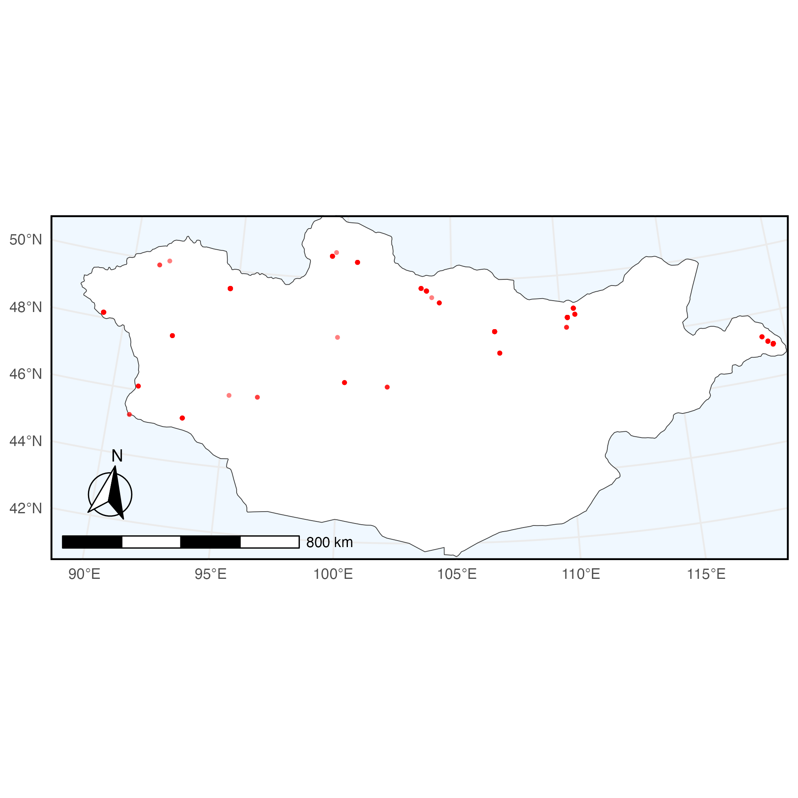
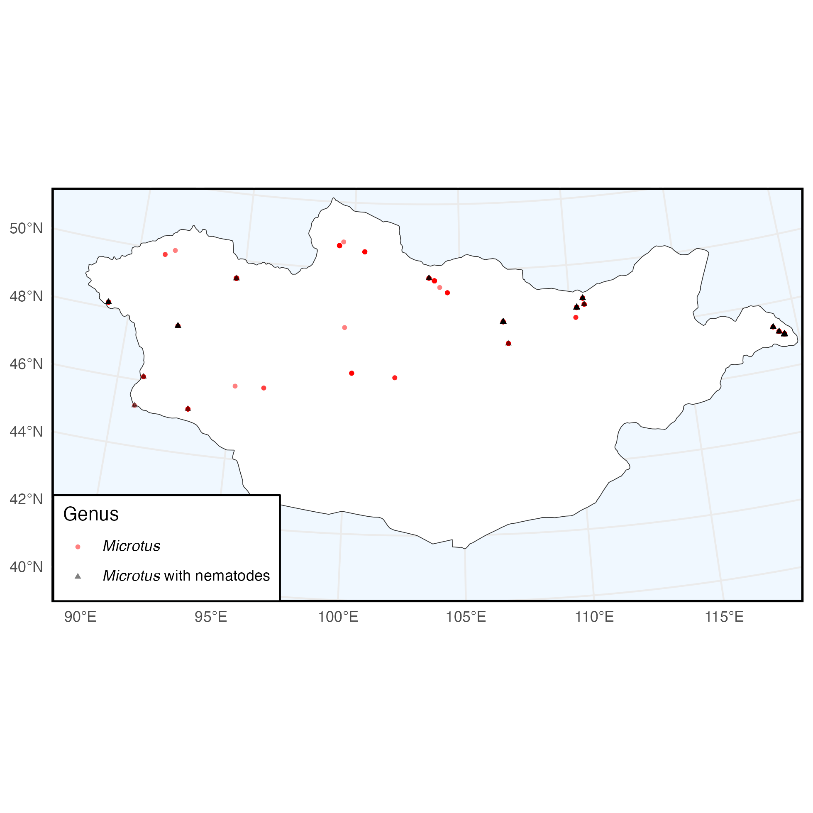

```{r, include = FALSE}
knitr::opts_chunk$set(
  collapse = TRUE,
  comment = "#>"
)
```

In this example, we query Arctos for all specimens of genus *Microtus* 
collected in Mongolia currently held in the collection of mammals of the Museum 
of Southwestern Biology which have been examined for parasites. After that, we
filter the downloaded data to find the specimens that were found to have
nematodes and use this filter to plot the spatial distribution of specimens
found with and without nematodes.

To begin, make sure to load the library:

```{r setup}
# install.packages("ArctosR")

library(ArctosR)
```

## Exploring Arctos options

First, we can view all parameters we can use to search by on Arctos:

```{r eval=FALSE}
# Request a list of all query parameters.
query_params <- get_query_parameters()

# Explore all parameters.
View(query_params)
```

The query parameters we are interested in using are: `guid_prefix`, `genus`,
`country`.

Next, we can view a list of all parameters we can ask Arctos to return by
calling:

```{r eval=FALSE}
# Request a list of all result parameters. These are the names that can show up
# as columns in a dataframe returned by ArctosR.
result_params <- get_result_parameters()

# Explore all parameters.
View(result_params)
```

The parameters we are interested in returning are: `guid`, `scientific_name`,
`dec_long`, `dec_lat`, `verbatim_date`, `parts`, `partdetail`.

Each parameter has a category. If we are only interested in certain categories
of result parameter, we can filter the data.frame returned by
`get_result_parameters()` like so:

```{r eval=FALSE}
# Check only core and record parameters.
result_params[result_params$category %in% c("core", "record"), 1:3]
```

## Requesting data

Next, we find the number of specimens matching the query we wanted to perform.
The first three arguments give values to some query parameters we queried
before with the `get_query_parameters` function.

We use the `filter_by` parameter to filter for specimens which only have the
attribute 'examined for' with the value 'parasite' which indicates that the
specimen has undergone some screening for parasites. Attributes are additional
data about a record such as quantitative information or a record of additional
processing done to the record.

```{r eval=FALSE}
# Request just the number of records matching a query.
count <- get_record_count(country = "Mongolia", genus = "Microtus",
                          guid_prefix = "MSB:Mamm",
                          filter_by=list("examined for"="parasite"),
                          api_key=YOUR_API_KEY)
```

It is helpful to call this first to make sure that we aren't asking for too many
items from Arctos. Next, to download data, we specify our query, and then use
the columns parameter to list all of the result parameters we want from our
query. Finally, we specify that we want to download all records. This is necessary
because Arctos paginates results, returning only 100 at a time. Setting
`all_records = TRUE` lets `get_records` repeatedly query Arctos until it receives
all records from the search.

```{r eval=FALSE}
# Request to download all available data matching a query (specific columns). 
microtus <- get_records(country = "Mongolia", genus = "Microtus",
                        guid_prefix = "MSB:Mamm",
                        columns = list("guid", "scientific_name", "dec_long", 
                                       "dec_lat", "verbatim_date", "parts", 
                                       "partdetail"),
                        filter_by=list("examined for"="parasite"),
                        all_records = TRUE,
                        api_key=YOUR_API_KEY)
```

In Arctos, some table entries, such as `partdetail` are themselves tables. We
can expand these tables into data.frames using:

```{r eval=FALSE}
# Expand a column that contains complex information in JSON format
expand_column(query = microtus, column_name = "partdetail")
```

The object returned from `get_records` contains both data and metadata about
the request which is useful for making further requests based on the data
returned from the first request. To get the data.frame of the response, use
`response_data` and pass in the response:

```{r eval=FALSE}
# Grab the dataframe of records from the response.
microtus_df <- response_data(microtus)

# Filter out records which are missing latitude and longitude information
microtus_df <- microtus_df[microtus_df$dec_lat != "" & microtus_df$dec_long != "", ]
```

## Filtering by attributes

Now, we write a custom function to check the `partdetail` entries of each specimen
for whether or not nematodes were present in the specimen.

```{r eval=FALSE}
# Filter the data to keep only Microtus records in which nematodes were found
## Whole-word match for 'nematode' or 'nematodes'
pattern <- "\\bnematodes?\\b"

## A small function to check within data.frames in partdetail 
has_nematode <- function(df) {
  if (!is.data.frame(df) || is.null(df[["part_name"]])) {
    return(FALSE)
  } else {
    return(any(grepl(pattern, df[["part_name"]], ignore.case = TRUE, perl = TRUE)))
  }
}

## Add column that is TRUE when a record has a nematode and FALSE otherwise
microtus_df$nematode <- sapply(microtus_df$partdetail, has_nematode)

## Subset of microtus_df with matches
microtus_df_nematode <- microtus_df[microtus_df$nematode == TRUE, ]
microtus_df_no_nematode <- microtus_df[microtus_df$nematode == FALSE, ]

## Number of Microtus from Mongolia 
nrow(microtus_df)

## Number of Microtus from Mongolia that had nematodes
nrow(microtus_df_nematode)

## Number of Microtus from Mongolia that did not have nematodes
nrow(microtus_df_no_nematode)
```

## Plotting spatial data

We can plot the spatial distribution of specimens with and without detected
nematodes using the `ggplot2` and `maps` packages. First, we can simply create a
plot of the distribution of all specimens overMongolia.

```{r eval=FALSE}
# Initial plot of Microtus sampled in Mongolia

## adapted from
## https://www.r-bloggers.com/2012/07/map-biodiversity-records-with-rgbif-maps-and-ggplot2-packages-in-r/

# install.packages("maps")
# install.packages("ggplot2")

library(maps)
library(ggplot2)

mongolia <- map_data("world", region="Mongolia")

ggplot(mongolia, aes(long, lat)) +
  geom_polygon(aes(group = group), fill = "white", color = "gray20",
               linewidth = .2) +
  geom_jitter(data = microtus_df,
              aes(x = as.numeric(dec_long), y = as.numeric(dec_lat)),
              alpha = .5, size = 2, color = "red") +
  coord_map("lambert", lat0 = 44, lat1 = 50, 
            xlim = c(87, 120), ylim = c(41.5, 52))
```

{width=98%}

Now this is what really highlights ArctosR's strengths; we can use the
additional data that Arctos provides to plot *Microtus* with and *Microtus* 
without detected nematodes using the filter we established earlier.

```{r eval=FALSE}
# Plot of Microtus sampled in Mongolia filtered by nematode detected/not detected

ggplot(mongolia, aes(long, lat)) +
  geom_polygon(aes(group = group), fill = "white", color = "gray20",
               linewidth = .2) +
  geom_jitter(data = microtus_df_no_nematode,
              aes(x = as.numeric(dec_long), y = as.numeric(dec_lat)),
              alpha = .5, size = 2, color = "black") +
  geom_jitter(data = microtus_df_nematode,
              aes(x = as.numeric(dec_long), y = as.numeric(dec_lat)),
              alpha = .5, size = 2, color = "red", shape="triangle") +
  coord_map("lambert", lat0 = 44, lat1 = 50, 
            xlim = c(87, 120), ylim = c(41.5, 52))
```

{width=98%}
