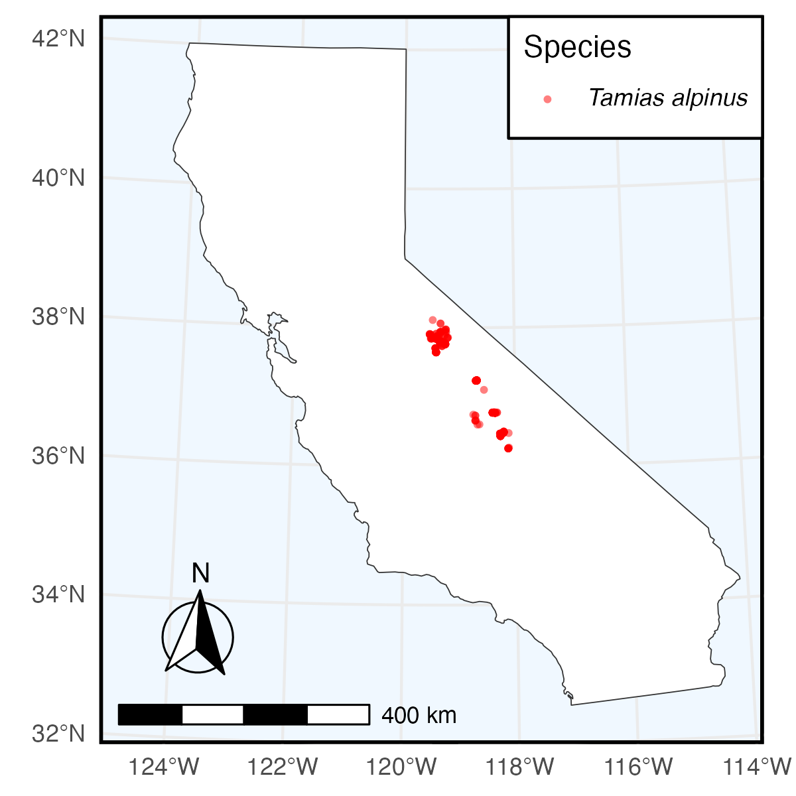

```{r, include = FALSE}
knitr::opts_chunk$set(
  collapse = TRUE,
  comment = "#>"
)
```

In this example, we perform a simple species search through Arctos and use the
data from that query to create a plot with ggplot2. We search for all Tamias
alpinus collected in California and stored in the Museum of Vertebrate
Zoology's collection. In our search we request longitude and latitude data, and
use that to plot points where specimens were collected over the state of
California.

To begin, make sure to load the library:

```{r setup}
# install.packages("ArctosR")
# install.packages("ggplot2")
# install.packages("ggspatial")
# install.packages("ggtext")
# install.packages("maps")

library(ArctosR)
library(ggplot2)
library(ggspatial)
library(ggtext)
library(maps)
```

## Exploring Arctos options

First, we can view all parameters we can use to search by on Arctos:

```{r eval=FALSE}
# Request a list of all query parameters.
query_params <- get_query_parameters()

# Explore all parameters.
View(query_params)
```

The query parameters we are interested in using are: `guid_prefix`, `genus`,
`species`, and `state_prov`.

Next, we can view a list of all parameters we can ask Arctos to return by
calling:

```{r eval=FALSE}
# Request a list of all result parameters. These are the names that can show up
# as columns in a dataframe returned by ArctosR.
result_params <- get_result_parameters()

# Explore all parameters.
View(result_params)
```

The parameters we are interested in returning are: `dec_lat` and `dec_long`.

## Requesting data

Next we can first ask for a count of how many records we expect our search to
return. If this count is not too large we can proceed to request all records.
From the response we can get a data.frame using the `response_data` function.

```{r eval=FALSE}
count <- get_record_count(guid_prefix="MVZ:Mamm", 
                          scientific_name="Tamias alpinus",
                          state_prov="California",
                          api_key=YOUR_API_KEY)

alpinus <- get_records(guid_prefix="MVZ:Mamm", scientific_name="Tamias alpinus",
                       state_prov="California",
                       columns=list("dec_lat", "dec_long"),
                       all_records=TRUE, api_key=YOUR_API_KEY)
```

```{r include=FALSE}
alpinus <- read_response_rds(
  system.file("extdata", "alpinus.RDS", package = "ArctosR"))
```

```{r eval=TRUE}
alpinus_df <- response_data(alpinus)

# Filter out records which are missing latitude and longitude information
alpinus_df <- alpinus_df[alpinus_df$dec_lat != "" & alpinus_df$dec_long != "", ]

nrow(alpinus_df)
```

## Plotting data

Now we use the `dec_lat` and `dec_long` fields from our data.frame to create
our plot:

```{r eval=TRUE}
# Plot of Tamias alpinus sampled in California and currently stored in the
# Museum of Vertebrate Zoology's collection

plot_map <- map_data("state", region=c("California"))

plot <- ggplot(plot_map, aes(long, lat)) +
  geom_polygon(
    aes(group = group), fill = "white", color = "gray20",
    linewidth = .2
  ) +
  geom_jitter(
    data = alpinus_df,
    aes(x = as.numeric(dec_long), y = as.numeric(dec_lat),
    color = "T. alpinus", shape = "T. alpinus"),
    alpha = .5, size = 2.0
  ) +
  scale_color_manual(
    values = c("T. alpinus" = "red"),
    labels = c("*Tamias alpinus*")
  ) +
  scale_shape_manual(
    values = c("T. alpinus" = 16),
    labels = c("*Tamias alpinus*")
  ) +
  labs(
    color = "Species", shape = "Species", x = NULL, y = NULL
  ) +
  coord_sf(
    crs = "+proj=lcc +lat_1=34 +lat_2=40.5 +lat_0=37.25 +lon_0=-119.25 +x_0=0 +y_0=0 +datum=WGS84 +units=m +no_defs",
    xlim = c(-125.5, -113.5),
    ylim = c(32, 42.5),
    default_crs = sf::st_crs(4326),
    expand = FALSE
  ) +
  annotation_scale(
    location = "bl",
    width_hint = 0.4
  ) +
  annotation_north_arrow(
    location = "bl",
    which_north = "true", 
    pad_x = unit(0.2, "in"),
    pad_y = unit(0.3, "in"),
    style = north_arrow_fancy_orienteering
  ) +
  theme_minimal() +
  theme(
    panel.background = element_rect(fill = "aliceblue"),
    panel.border = element_rect(color = "black", fill = NA, linewidth = 1.25),
    legend.position = c(0.998, 0.998),
    legend.justification = c(1, 1),
    legend.background = element_rect(fill = "white"),
    legend.text = element_markdown(),
    legend.title = element_blank()
  )

ggsave(
  filename = "figures/california.png",
  plot = plot,
  width = 4,
  height = 4,
  dpi = 300
)
```

The result of which is:

{width=98%}
