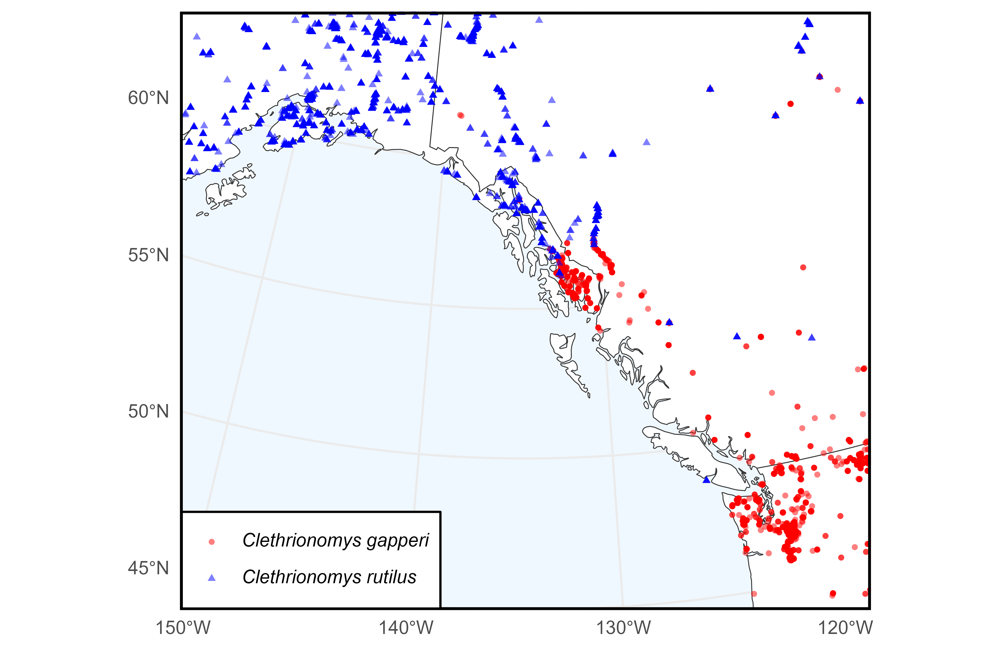
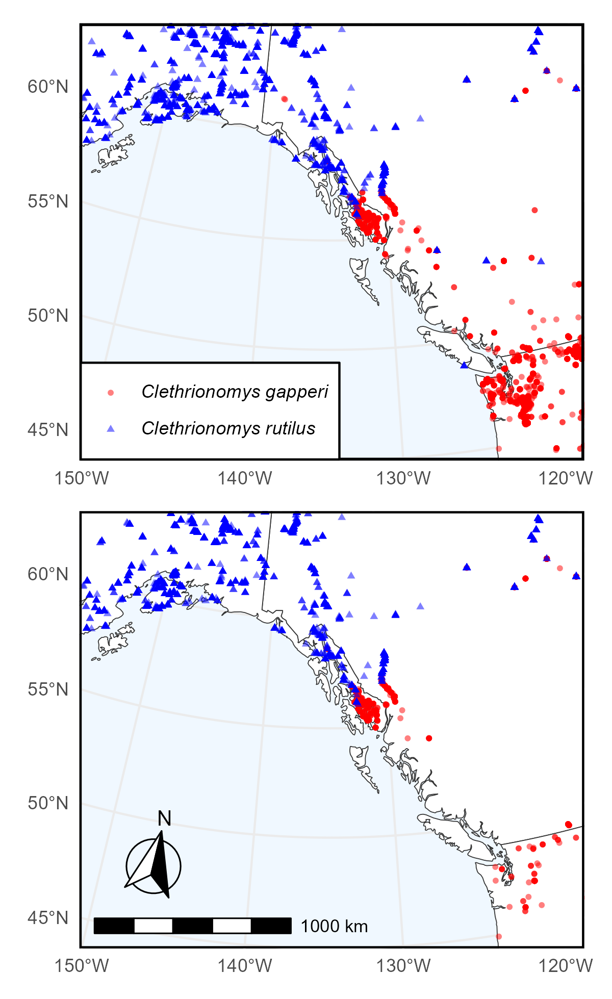

```{r, include = FALSE}
knitr::opts_chunk$set(
  collapse = TRUE,
  comment = "#>",
  fig.width = 8,
  fig.height = 6,
  dpi = 600
)
```

In this example we query Arctos for specimens of Clethrionomys gapperi (Southern
red-backed vole) and Clethrionomys rutilus (Northern red-backed vole) that have
frozen tissue.

To begin, make sure to load the library:

```{r setup}
# install.packages("ArctosR")
# install.packages("ggplot2")
# install.packages("ggspatial")
# install.packages("ggtext")
# install.packages("maps")
# install.packages("patchwork")
# install.packages("sf")

library(ArctosR)
library(ggplot2)
library(ggspatial)
library(ggtext)
library(maps)
library(patchwork)
library(sf)
```

## Exploring Arctos options

First, we can view all parameters we can use to search by on Arctos:

```{r eval=FALSE}
# Request a list of all query parameters.
query_params <- get_query_parameters()

# Explore all parameters.
View(query_params)
```

The query parameter we are interested in using is: `scientific_name`.

Next, we can view a list of all parameters we can ask Arctos to return by
calling:

```{r eval=FALSE}
# Request a list of all result parameters. These are the names that can show up
# as columns in a dataframe returned by ArctosR.
result_params <- get_result_parameters()

# Explore all parameters.
View(result_params)
```

The parameters we are interested in returning are: `dec_lat`, `dec_long`, and
`parts`.

## Requesting data

```{r eval=FALSE}
cols <- list("dec_lat", "dec_long", "parts")

# Southern red-backed vole
gapperi_query1 <- get_records(
  scientific_name = "Clethrionomys gapperi",
  columns = cols,
  all_records = TRUE,
  api_key = YOUR_API_KEY
)

gapperi_query2 <- get_records(
  scientific_name = "Myodes gapperi",
  columns = cols,
  all_records = TRUE,
  api_key = YOUR_API_KEY
)

# Northern red-backed vole
rutilus_query1 <- get_records(
  scientific_name = "Clethrionomys rutilus",
  columns = cols,
  all_records = TRUE,
  api_key = YOUR_API_KEY
)

rutilus_query2 <- get_records(
  scientific_name = "Myodes rutilus",
  columns = cols,
  all_records = TRUE,
  api_key = YOUR_API_KEY
)
```

```{r include=FALSE}
gapperi_query1 <- read_response_rds(
  system.file("extdata", "gapperi_query1.RDS", package = "ArctosR"))
gapperi_query2 <- read_response_rds(
  system.file("extdata", "gapperi_query2.RDS", package = "ArctosR"))
rutilus_query1 <- read_response_rds(
  system.file("extdata", "rutilus_query1.RDS", package = "ArctosR"))
rutilus_query2 <- read_response_rds(
  system.file("extdata", "rutilus_query2.RDS", package = "ArctosR"))
```

```{r eval=TRUE}
gapperi_df <- rbind(
  response_data(gapperi_query1),
  response_data(gapperi_query2)
)
rutilus_df <- rbind(
  response_data(rutilus_query1),
  response_data(rutilus_query2)
)
```

```{r eval=TRUE}
# Plot of overall species ranges

plot_map <- map_data("world", region=c("USA", "Canada"))

vole1 <- ggplot(plot_map, aes(long, lat)) +
  geom_polygon(
    aes(group = group), fill = "white", color = "gray20",
    linewidth = .2
  ) +
  geom_jitter(
    data = gapperi_df,
    aes(x = as.numeric(dec_long), y = as.numeric(dec_lat),
    color = "C. gapperi", shape = "C. gapperi"),
    alpha = .5, size = 1.0
  ) +
  geom_jitter(
    data = rutilus_df,
    aes(x = as.numeric(dec_long), y = as.numeric(dec_lat),
    color = "C. rutilus", shape = "C. rutilus"),
    alpha = .5, size = 1.0
  ) +
  scale_color_manual(
    values = c("C. gapperi" = "red", "C. rutilus" = "blue"),
    labels = c("*Clethrionomys gapperi*", "*Clethrionomys rutilus*")
  ) +
  scale_shape_manual(
    values = c("C. gapperi" = 16, "C. rutilus" = 17),
    labels = c("*Clethrionomys gapperi*", "*Clethrionomys rutilus*")
  ) +
  labs(
    # title = "Filtering *C. gapperi* and *C. rutilus* by tissue availability",
    color = "Species", shape = "Species", x = NULL, y = NULL
  ) +
  coord_sf(
    crs = "+proj=lcc +lat_1=52 +lat_2=68 +lon_0=-134.5 +datum=WGS84",
    xlim = c(-155, -114), 
    ylim = c(45, 65),
    default_crs = sf::st_crs(4326),
    expand = FALSE
  ) +
  theme_minimal() +
  theme(
    panel.background = element_rect(fill = "aliceblue"),
    panel.border = element_rect(color = "black", fill = NA, linewidth = 1.25),
    legend.position = c(0.0025, 0.0025),
    legend.justification = c(0, 0),
    legend.background = element_rect(fill = "white"),
    legend.text = element_markdown(),
    legend.title=element_blank()
  )

ggsave(
  filename = "figures/vole1.png",
  plot = vole1,
  width = 6.53,
  height = 4.25,
  dpi = 600,
  create.dir = TRUE
)

```

{width=98%}

```{r eval=TRUE}
gapperi_df_tissue <- gapperi_df[
  grepl("frozen", gapperi_df$parts, ignore.case = TRUE, perl = TRUE), ]

rutilus_df_tissue <- rutilus_df[
  grepl("frozen", rutilus_df$parts, ignore.case = TRUE, perl = TRUE), ]

nrow(gapperi_df_tissue)
nrow(rutilus_df_tissue)
```

```{r eval=TRUE}
# Plot of overall species ranges, filtering by specimens with frozen tissue

vole2 <- ggplot(plot_map, aes(long, lat)) +
  geom_polygon(
    aes(group = group), fill = "white", color = "gray20",
    linewidth = .2
  ) +
  geom_jitter(
    data = gapperi_df_tissue,
    aes(x = as.numeric(dec_long), y = as.numeric(dec_lat),
    color = "C. gapperi", shape = "C. gapperi"),
    alpha = .5, size = 1.0
  ) +
  geom_jitter(
    data = rutilus_df_tissue,
    aes(x = as.numeric(dec_long), y = as.numeric(dec_lat),
    color = "C. rutilus", shape = "C. rutilus"),
    alpha = .5, size = 1.0
  ) +
  scale_color_manual(
    values = c("C. gapperi" = "red", "C. rutilus" = "blue"),
    labels = c("*Clethrionomys gapperi*", "*Clethrionomys rutilus*")
  ) +
  scale_shape_manual(
    values = c("C. gapperi" = 16, "C. rutilus" = 17),
    labels = c("*Clethrionomys gapperi*", "*Clethrionomys rutilus*")
  ) +
  labs(
    color = "Species", shape = "Species", x = NULL, y = NULL
  ) +
  coord_sf(
    crs = "+proj=lcc +lat_1=52 +lat_2=68 +lon_0=-134.5 +datum=WGS84",
    xlim = c(-155, -114), 
    ylim = c(45, 65),
    default_crs = sf::st_crs(4326),
    expand = FALSE
  ) +
  annotation_scale(
    location = "bl",
    width_hint = 0.4
  ) +
  annotation_north_arrow(
    location = "bl",
    which_north = "true", 
    pad_x = unit(0.2, "in"),
    pad_y = unit(0.3, "in"),
    style = north_arrow_fancy_orienteering
  ) +
  theme_minimal() +
  theme(
    panel.background = element_rect(fill = "aliceblue"),
    panel.border = element_rect(color = "black", fill = NA, linewidth = 1),
    legend.position = "none"
  )

ggsave(
  filename = "figures/vole2.png",
  plot = vole2,
  width = 6.53,
  height = 6.53,
  dpi = 600,
  create.dir = TRUE
)

ggsave(
  filename = "figures/voles_combined.png",
  plot = vole1/vole2,
  width = 4,
  height = 6.53,
  dpi = 600,
  create.dir = TRUE
)
```

{width=98%}
