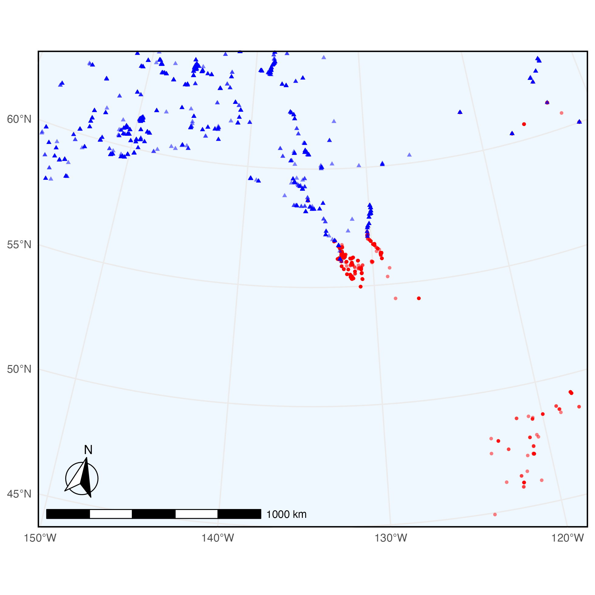

```{r, include = FALSE}
knitr::opts_chunk$set(
  collapse = TRUE,
  comment = "#>"
)
```

In this example we query Arctos for specimens of Clethrionomys gapperi (Southern
red-backed vole) and Clethrionomys rutilus (Northern red-backed vole) that have
frozen tissue.

To begin, make sure to load the library:

```{r setup}
# install.packages("ArctosR")

library(ArctosR)
```

## Exploring Arctos options

First, we can view all parameters we can use to search by on Arctos:

```{r eval=FALSE}
# Request a list of all query parameters.
query_params <- get_query_parameters()

# Explore all parameters.
View(query_params)
```

The query parameter we are interested in using is: `scientific_name`.

Next, we can view a list of all parameters we can ask Arctos to return by
calling:

```{r eval=FALSE}
# Request a list of all result parameters. These are the names that can show up
# as columns in a dataframe returned by ArctosR.
result_params <- get_result_parameters()

# Explore all parameters.
View(result_params)
```

The parameters we are interested in returning are: `dec_lat`, `dec_long`, and
`parts`.

## Requesting data

```{r eval=FALSE}
cols <- list("dec_lat", "dec_long", "parts")

# Southern red-backed vole
gapperi_query <- get_records(
  scientific_name = "Clethrionomys gapperi",
  columns = cols,
  all_records = TRUE,
  api_key = YOUR_API_KEY
)

# Northern red-backed vole
rutilus_query <- get_records(
  scientific_name = "Clethrionomys rutilus",
  columns = cols,
  all_records = TRUE,
  api_key = YOUR_API_KEY
)

gapperi_df <- response_data(gapperi_query)
rutilus_df <- response_data(rutilus_query)
```

```{r eval=FALSE}
# Plot of overall species ranges

## adapted from
## https://www.r-bloggers.com/2012/07/map-biodiversity-records-with-rgbif-maps-and-ggplot2-packages-in-r/

# install.packages("maps")
# install.packages("ggplot2")

library(maps)
library(ggplot2)

plot_map <- map_data("world", region=c("USA", "Canada"))

ggplot(plot_map, aes(long, lat)) +
  geom_polygon(aes(group = group), fill = "white", color = "gray20",
               linewidth = .2) +
  geom_jitter(data = gapperi_df,
              aes(x = as.numeric(dec_long), y = as.numeric(dec_lat),
                  color = "C. gapperi", shape = "C. gapperi"),
              alpha = .5, size = 1.5) +
  geom_jitter(data = rutilus_df,
              aes(x = as.numeric(dec_long), y = as.numeric(dec_lat),
                  color = "C. rutilus", shape = "C. rutilus"),
              alpha = .5, size = 1.5) +
  scale_color_manual(values = c("C. gapperi" = "red", "C. rutilus" = "blue")) +
  scale_shape_manual(values = c("C. gapperi" = 16, "C. rutilus" = 17)) +
  labs(color = "Species", shape = "Species") +
  coord_map(xlim = c(-155, -114), ylim = c(45, 65))
```

{width=98%}

```{r eval=FALSE}
# Plot of hybridization area

plot_map <- map_data("world", region=c("USA", "Canada"))

ggplot(plot_map, aes(long, lat)) +
  geom_polygon(aes(group = group), fill = "white", color = "gray20",
               linewidth = .2) +
  geom_jitter(data = gapperi_df,
              aes(x = as.numeric(dec_long), y = as.numeric(dec_lat),
                  color = "C. gapperi", shape = "C. gapperi"),
              alpha = .5, size = 1.5) +
  geom_jitter(data = rutilus_df,
              aes(x = as.numeric(dec_long), y = as.numeric(dec_lat),
                  color = "C. rutilus", shape = "C. rutilus"),
              alpha = .5, size = 1.5) +
  scale_color_manual(values = c("C. gapperi" = "red", "C. rutilus" = "blue")) +
  scale_shape_manual(values = c("C. gapperi" = 16, "C. rutilus" = 17)) +
  labs(color = "Species", shape = "Species") +
  coord_map(xlim = c(-140, -115), ylim = c(50, 60))
```

{width=98%}

```{r eval=FALSE}
gapperi_df_tissue <- gapperi_df[
  grepl("frozen", gapperi_df$parts, ignore.case = TRUE, perl = TRUE), ]

rutilus_df_tissue <- rutilus_df[
  grepl("frozen", rutilus_df$parts, ignore.case = TRUE, perl = TRUE), ]

nrow(gapperi_df_tissue)
nrow(rutilus_df_tissue)
```

```{r eval=FALSE}
# Plot of hybridization area, filtering by specimens with frozen tissue

ggplot(plot_map, aes(long, lat)) +
  geom_polygon(aes(group = group), fill = "white", color = "gray20",
               linewidth = .2) +
  geom_jitter(data = gapperi_df_tissue,
              aes(x = as.numeric(dec_long), y = as.numeric(dec_lat),
                  color = "C. gapperi", shape = "C. gapperi"),
              alpha = .5, size = 1.5) +
  geom_jitter(data = rutilus_df_tissue,
              aes(x = as.numeric(dec_long), y = as.numeric(dec_lat),
                  color = "C. rutilus", shape = "C. rutilus"),
              alpha = .5, size = 1.5) +
  scale_color_manual(values = c("C. gapperi" = "red", "C. rutilus" = "blue")) +
  scale_shape_manual(values = c("C. gapperi" = 16, "C. rutilus" = 17)) +
  labs(color = "Species", shape = "Species") +
  coord_map(xlim = c(-140, -115), ylim = c(50, 60))
```

{width=98%}
